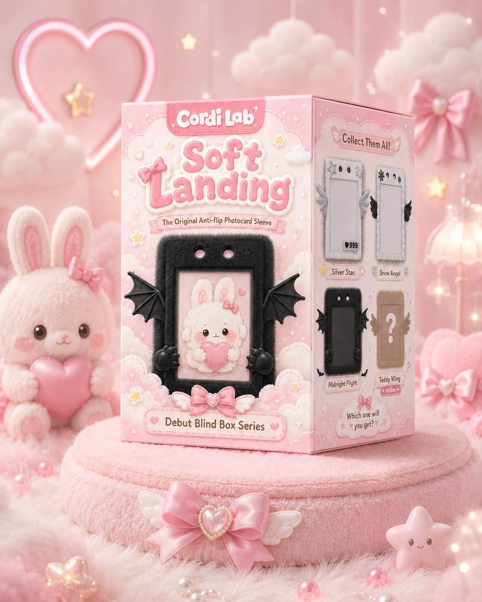

# Cordi Lab — Soft Landing

**Photocard sleeves that never flip backwards — sold as blind-box collectibles.** Photocards exist to be displayed, but in a normal sleeve or holder the card spins and flips so you're showing the world the back of the card. Ours locks the card facing forward, always — and the sleeve itself is a collectible design you pull blind-box style.

**Live store:** https://0103-parv.github.io/alpha-evolver/
**3D design review:** https://0103-parv.github.io/alpha-evolver/design/
**Packaging mockup:** https://0103-parv.github.io/alpha-evolver/design/box/

## The product

Series 1 — **Soft Landing**: each blind box contains one designed photocard sleeve. Three regular designs plus one hidden lucky variant:

| Design | Rarity |
| --- | --- |
| Silver Star | regular |
| Snow Angel | regular |
| Midnight Flight | regular |
| Teddy Wing | hidden / lucky |

- Single blind box **$7.99** · Complete set of 3 (one of each regular design) **$19.99**
- Free US shipping over $40, flat $4.99 under
- Produced in China; ~1 week shipping to the US

## Why it works

- The blind-box market is exploding (Pop Mart, Labubu) — but it's all figurines. Nobody has applied the mechanic to the thing photocard collectors already buy repeatedly.
- Sleeves are consumable + collectible + cheap to make and ship (flat, light) — blind-box margins without blind-box logistics.
- Hidden "lucky" variant drives repeat purchases and trade culture, exactly like photocard pulls themselves.

## Where we are

- Working online store with real Stripe checkout (test mode until business verification)
- Finished packaging + 4 sleeve designs, reviewed in a 3D viewer
- Promo videos cut for square + vertical ([marketing/](marketing/))
- Manufacturing sourced in China; regional pricing for CN/JP/KR under discussion

## The brand

Coco, our parachuting mascot, guides the store (chat widget with FAQ answers) and fronts a loyalty program: 10 points per $1, 100 points = $1 off. A gentle start — a soft landing — for a collectibles brand built around care and intention.

---

*Contact: Parv Mehndiratta · store repo: github.com/0103-parv/alpha-evolver (branch `claude/product-website-4i70e8`)*
